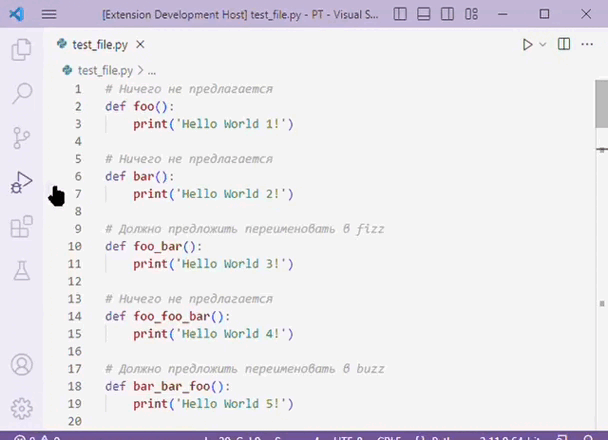
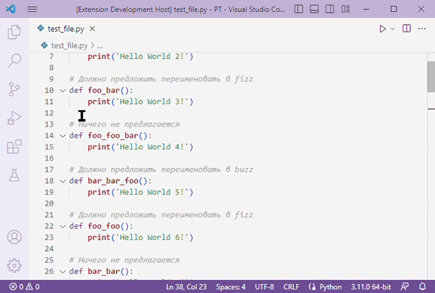
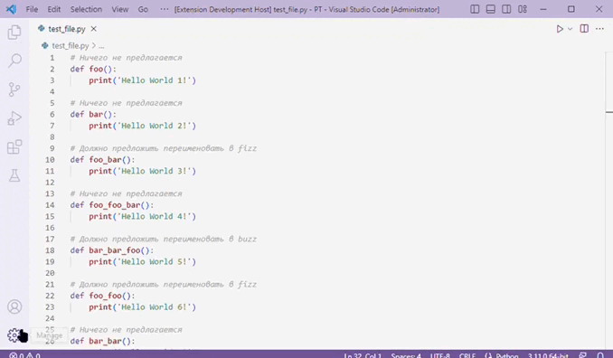

# FizzBuzz extension

This extension allows to rename functions based on their sequence number in Python files. Code actions are used to implement quick fixes in VS Code.

The extension uses the [`CodeActionProvider`](https://code.visualstudio.com/api/references/vscode-api#CodeActionProvider) api to implement code actions that convert function name.
The default settings are:
- 'fizz' if function sequence number is multiple 3, 
- 'buzz' if function sequence number is multiple 5,
- 'fizz_buzz' if function sequence number is multiple both 3 and 5.

In case of collisions, a numeric suffix is added to the function name:

Setting of user parameters is available in the extension settings:
